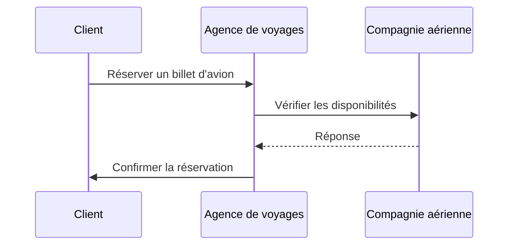
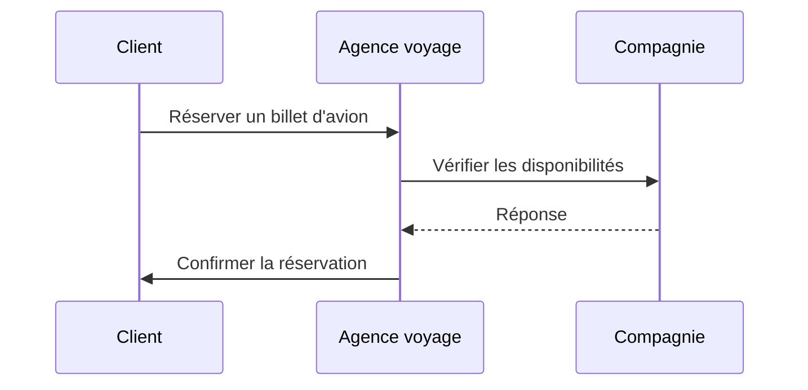
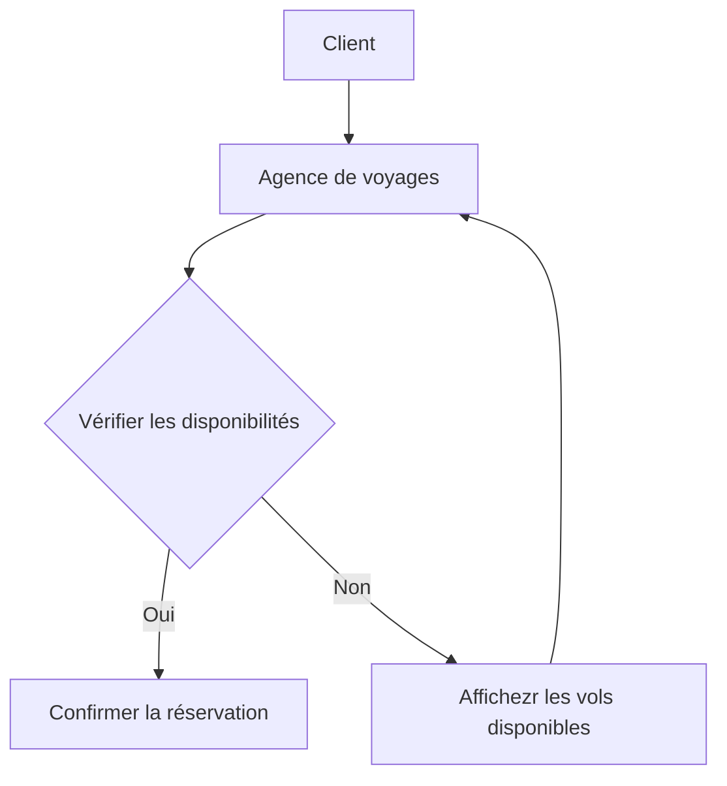
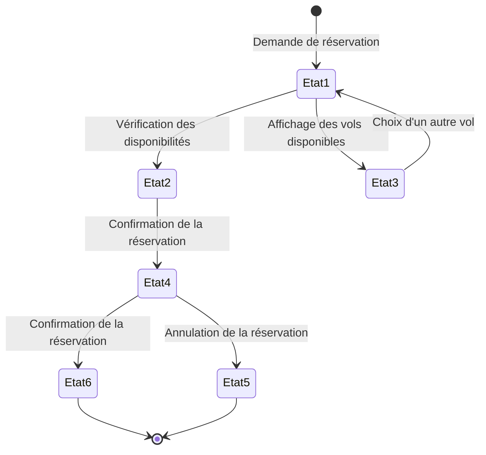
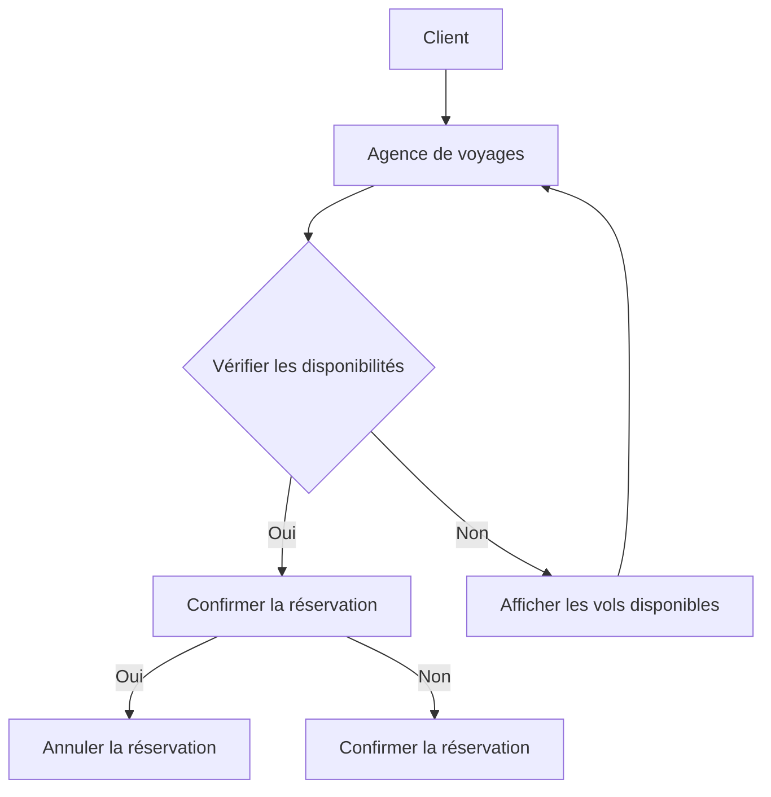

```mermaid
sequenceDiagram
Client->>Agence de voyages: Réserver un billet d'avion
Agence de voyages->>Compagnie aérienne: Vérifier les disponibilités
Compagnie aérienne-->>Agence de voyages: Réponse
Agence de voyages->>Client: Confirmer la réservation

```

```mermaid
sequenceDiagram
Client->>Agence voyage: Réserver un billet d'avion
Agence voyage->>Compagnie: Vérifier les disponibilités
Compagnie -->>Agence voyage: Réponse
Agence voyage->>Client: Confirmer la réservation
```

```mermaid
graph TD
A[Client] --> B[Agence de voyages]
B --> C{Vérifier les disponibilités}
C -->|Oui| D[Confirmer la réservation]
C -->|Non| E[Affichezr les vols disponibles]
E --> B
```

```mermaid
stateDiagram
[*] --> Etat1: Demande de réservation
Etat1 --> Etat2: Vérification des disponibilités
Etat1 --> Etat3: Affichage des vols disponibles
Etat2 --> Etat4: Confirmation de la réservation
Etat3 --> Etat1: Choix d'un autre vol
Etat4 --> Etat5: Annulation de la réservation
Etat4 --> Etat6: Confirmation de la réservation
Etat6 --> [*]
Etat5 --> [*]
```

```mermaid
graph TD
A[Client] --> B[Agence de voyages]
B --> C{Vérifier les disponibilités}
C -->|Oui| D[Confirmer la réservation]
C -->|Non| E[Afficher les vols disponibles]
D -->|Oui| F[Annuler la réservation]
D -->|Non| G[Confirmer la réservation]
E --> B
```

# Use Case 
## Scénario 
